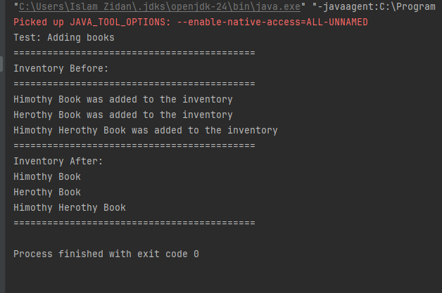
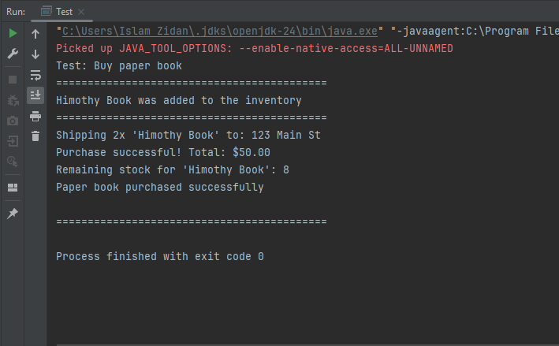
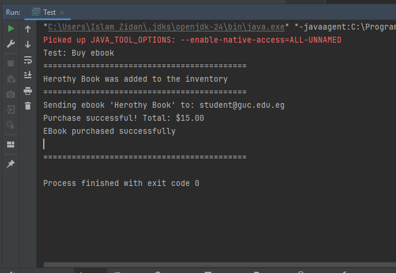
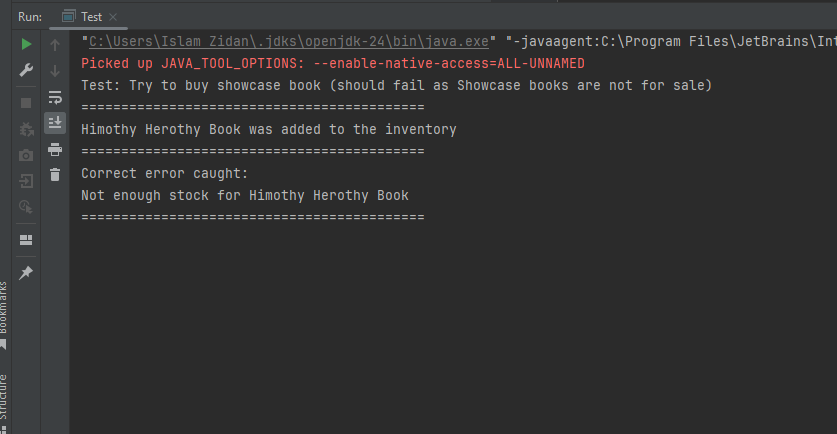
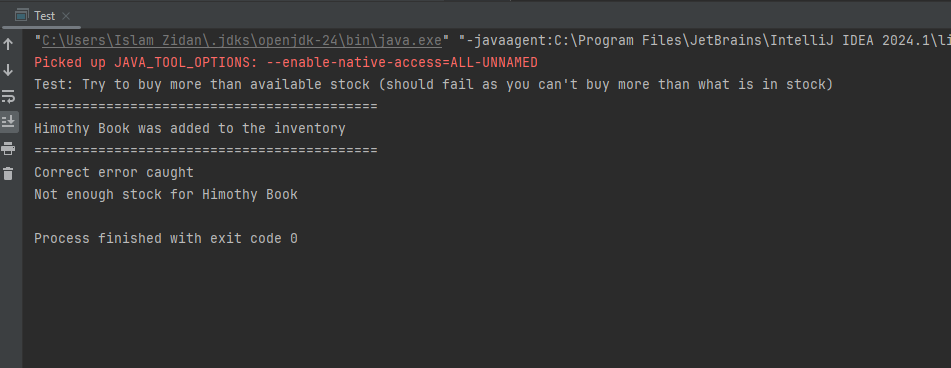
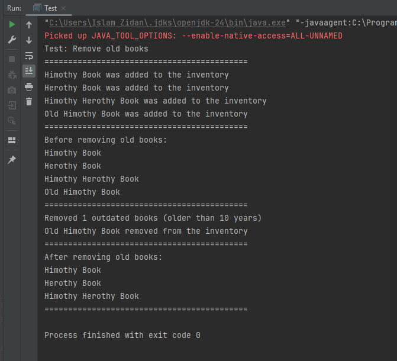

# Quantum Bookstore - Java Project

## Overview
This is a bookstore management system written in Java. It can handle different types of books and process orders.

## What it does
- Add books to inventory (paper books, e-books, showcase books)
- Buy books with different delivery methods
- Track stock for physical books
- Remove old books from inventory
- Handle errors when books aren't available

## Files in the project
- `Book.java` - Main book class (abstract)
- `PaperBook.java` - Physical books with stock
- `EBook.java` - Digital books
- `ShowcaseBook.java` - Display books (not for sale)
- `QuantumBookstore.java` - Main bookstore class
- `MailService.java` - Sends e-books by email
- `ShippingService.java` - Ships physical books
- `Test.java` - Test cases

## How to run
1. Compile all files: `javac *.java`
2. Run tests: `java Test`

## Tests included
- Adding books to inventory
- Buying paper books
- Buying e-books
- Trying to buy showcase books (should fail)
- Buying more than available stock (should fail)
- Removing old books

## Screenshots

### Test 1: Adding Books

### Test 2: Buying Paper Book

### Test 3: Buying E-Book

### Test 4: Showcase Book Error

### Test 5: Insufficient Stock Error

### Test 6: Remove Old Books

## Notes
- E-books don't run out of stock
- Paper books have limited stock
- Showcase books are just for display
- The system automatically calculates total prices